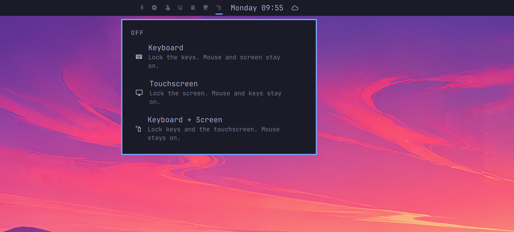
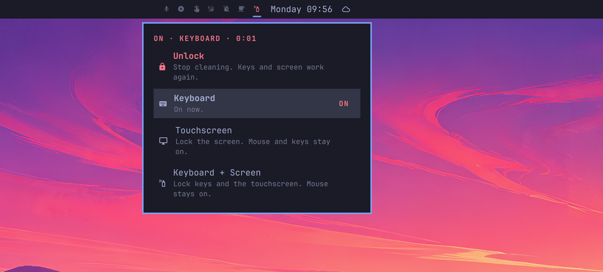

# Stay Clean

An Omarchy bar control that locks the keyboard, the touchscreen, or both
so you can wipe them without typing or tapping garbage.


Click the spray bottle, pick a mode, clean, then **Unlock**. The mouse and
trackpad stay available the whole time.



Unlike KeyboardCleanTool and keyboard-only cleaners, Stay Clean can also
freeze the touchscreen. It is a Stay Awake-style bar control with a small
menu for which surface you want frozen.

While a lock is on, the spray bottle uses the bar's active color, the menu
header reads `ON · KEYBOARD · 0:12` (or whichever mode is live), and that
row is marked **ON**.



MIT licensed. Plugins run unsandboxed inside `omarchy-shell`.

## Install

Read this repo first, then:

```bash
omarchy plugin add https://github.com/martlets/omarchy-stay-clean.git --enable
```

That places a spray-bottle icon (`nf-md-spray`) in the center of the bar.
To sit it next to Stay Awake:

```bash
omarchy bar move io.github.martlets.stay-clean --after omarchy.indicators
```

## Use

- Click the spray-bottle icon.
- Choose **Keyboard**, **Touchscreen**, or **Keyboard + Screen**.
- Click the icon again and hit **Unlock** to stop.

There is deliberately no keyboard shortcut to unlock. The pointer is the
way out. The touchscreen is only locked when a mouse or trackpad is still
there to get you out.

From a terminal or bind you already have:

```bash
omarchy-shell io.github.martlets.stay-clean toggle
omarchy-shell io.github.martlets.stay-clean status
omarchy-shell io.github.martlets.stay-clean lockKeyboard
omarchy-shell io.github.martlets.stay-clean lockTouch
omarchy-shell io.github.martlets.stay-clean lockBoth
omarchy-shell io.github.martlets.stay-clean unlock
```

## What it will not do

- It does not write Hyprland config. Device disables are runtime `hyprctl eval`
  calls and vanish on compositor restart.
- It does not persist across reboot, logout, or a dead `omarchy-shell`.
- It does not disable mice, touchpads, the power or sleep buttons, the
  privacy kill-switch, or the fcitx virtual keyboard.
- It does not need elevated privileges, install hooks, or a cloned first-party plugin.
- It inhibits idle/sleep only while locked, then drops the inhibitor.

If `omarchy-shell` crashes while a surface is locked, a tiny restore-only
watchdog in `XDG_RUNTIME_DIR` turns the devices back on. A 45-minute timer
does the same if you forget it is on.

## Dependencies

- [Omarchy](https://omarchy.org) / `omarchy-shell` (Quickshell)
- `hyprctl` (Hyprland), used as argv only, never through a shell
- `python3` (standard library only) for the restore-only watchdog
- `systemd-inhibit` while a lock is active

No extra packages, no network, no sudo.

## Remove

```bash
omarchy plugin remove io.github.martlets.stay-clean
```

If a lock was active, click the icon (or run `unlock`) before removing the
plugin so the current session restores immediately. A leftover runtime lock
file is cleared on the next service start, on watchdog timeout, or at logout.

## Develop

```bash
omarchy plugin validate .
node tests/test_model.js
python3 tests/test_watchdog.py
```
